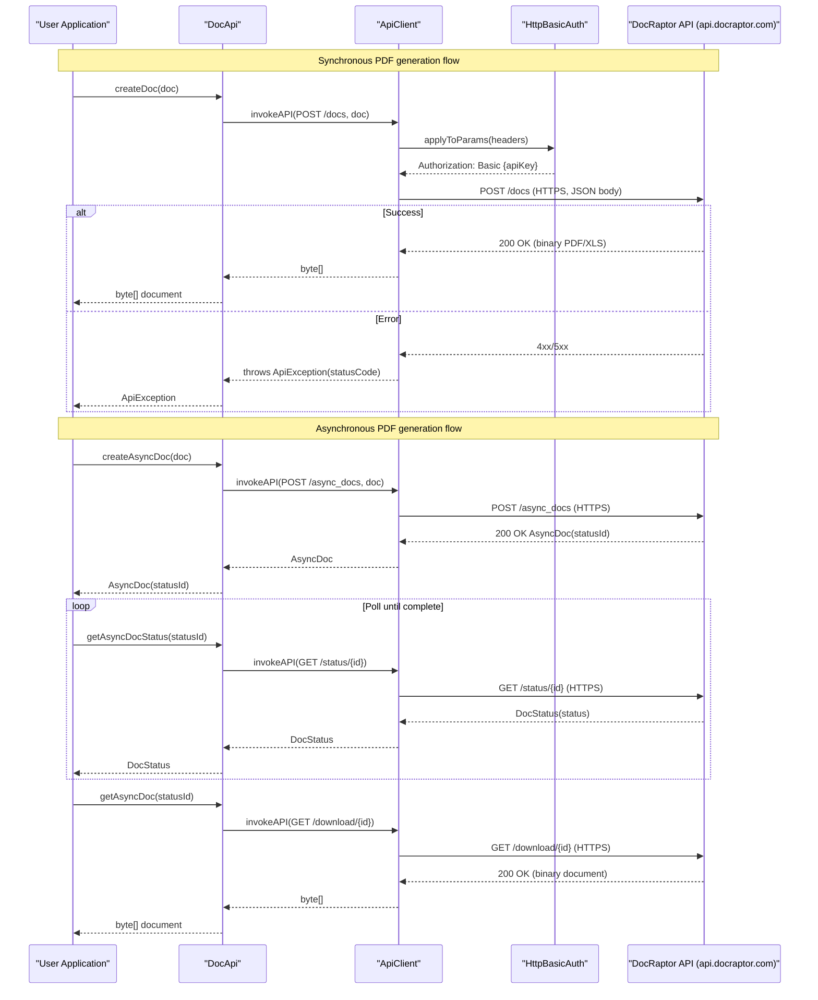

# API & Service Communication Contracts

This document covers the 5 outbound API operations exposed by the DocRaptor Java client library against the DocRaptor REST API (`https://api.docraptor.com`). All communication is synchronous HTTPS.

## Service Catalog

| Service | Port | Category | Purpose |
|---|---|---|---|
| DocRaptor REST API (external) | 443 (HTTPS) | API Layer | Remote HTML-to-PDF/XLS document generation service consumed by this library |
| docraptor-java (this library) | N/A (library) | Business | Java client wrapper that maps method calls to DocRaptor REST API requests |

## API Endpoints Inventory

> Note: These are **outbound** calls made by this library to the DocRaptor API. There are no inbound server-side endpoints in this project.

| Client Method | HTTP Method | Path | Request Type | Response Type |
|---|---|---|---|---|
| `DocApi.createDoc(Doc)` | POST | `/docs` | `Doc` (JSON body) | `byte[]` (binary document) |
| `DocApi.createAsyncDoc(Doc)` | POST | `/async_docs` | `Doc` (JSON body) | `AsyncDoc` (JSON) |
| `DocApi.createHostedDoc(Doc)` | POST | `/docs` | `Doc` (JSON body, `hosted: true`) | `DocStatus` (JSON) |
| `DocApi.createHostedAsyncDoc(Doc)` | POST | `/async_docs` | `Doc` (JSON body, `hosted: true`) | `AsyncDoc` (JSON) |
| `DocApi.getAsyncDocStatus(String id)` | GET | `/status/{id}` | Path param `id` | `DocStatus` (JSON) |
| `DocApi.getAsyncDoc(String id)` | GET | `/download/{id}` | Path param `id` | `byte[]` (binary document) |

## Management & Observability Endpoints

| Service | Endpoint | Custom Metrics |
|---|---|---|
| docraptor-java | None — library only, no embedded server | None |
| DocRaptor REST API | Not applicable (external SaaS) | None |

No Spring Boot Actuator, health check, or metrics endpoints are present. This is a library, not a standalone service.

## DTOs & Contracts

**Service-level domain models** (all in `com.docraptor` package):

- **`Doc`** — Request body model. Carries document content (`content`), type (`pdf` or `xls`), rendering options (`PrinceOptions`), async options (`callback_url`), and hosting flags. Mutable POJO serialized to JSON via Jackson.
- **`AsyncDoc`** — Response model for asynchronous document creation. Contains a `status_id` for subsequent polling. Mutable POJO.
- **`DocStatus`** — Response model for status polling and hosted document creation. Contains status string and download URL. Mutable POJO.
- **`PrinceOptions`** — Nested model inside `Doc` providing PrinceXML PDF rendering configuration. Mutable POJO.

**OpenAPI specification**: The project ships `docraptor.yaml` (OpenAPI 3.x) at the repository root. The Java classes are auto-generated from this specification via `openapi-generator-tech`. Swagger 1.6.3 annotations (`@ApiModel`, `@ApiModelProperty`) are also present on the generated classes for legacy tooling compatibility, though these are inconsistent with the OpenAPI 3.x spec.

**Serialization**: Jackson 2.12.x with `JodaModule` and `JavaTimeModule` registered on `ApiClient`'s `ObjectMapper`. No custom serializers; standard Jackson annotations (`@JsonProperty`, `@JsonIgnoreProperties`) are used. Date-time fields use `RFC3339DateFormat`.

For full field definitions, see `data-architecture.md`.

## Communication Patterns

**Synchronous REST over HTTPS**: All communication is synchronous blocking HTTP via Jersey Client 1.19.4. The `ApiClient` constructs a `com.sun.jersey.api.client.Client`, sends the request, and waits for the response. There is no reactive or async HTTP support at the transport layer.

**Asynchronous workflow (polling pattern)**: The async document generation flow is a client-side polling pattern:
1. Call `createAsyncDoc()` → receive `AsyncDoc.statusId`
2. Poll `getAsyncDocStatus(statusId)` until `DocStatus.status == "completed"`
3. Call `getAsyncDoc(statusId)` to download the binary result

Alternatively, a `callback_url` can be set on `Doc` so the DocRaptor service posts back when complete.

**No resilience patterns**: There is no circuit breaker, retry policy, timeout configuration, or bulkhead implemented in this library. `ApiClient` sets `connectionTimeout = 0` (infinite) by default. Consumers must implement their own retry and timeout logic.

**No service discovery**: The base URL is hardcoded as `https://api.docraptor.com` in `ApiClient` and in `ServerConfiguration`. It can be overridden via `ApiClient.setBasePath()`.

**Security posture**: Authentication is performed via HTTP Basic Auth (`HttpBasicAuth`) — the DocRaptor API key is supplied as the username with an empty password. The `Authentication` interface supports `HttpBearerAuth` and `ApiKeyAuth` as well, but only `HttpBasicAuth` is wired by default. All communication uses HTTPS (TLS), enforced by the remote endpoint. No client-side certificate pinning or explicit TLS version constraints are configured. No authorization layer exists in this library — access control is entirely delegated to the remote DocRaptor API.

## Service Technology Matrix

| Service | Web Framework | Data Access | Discovery | Gateway | Actuator/Health | Cache | Metrics |
|---|---|---|---|---|---|---|---|
| docraptor-java (library) | Jersey Client 1.19.4 (outbound only) | None | Hardcoded URL | None | None | None | None |

## Service Communication Sequence

