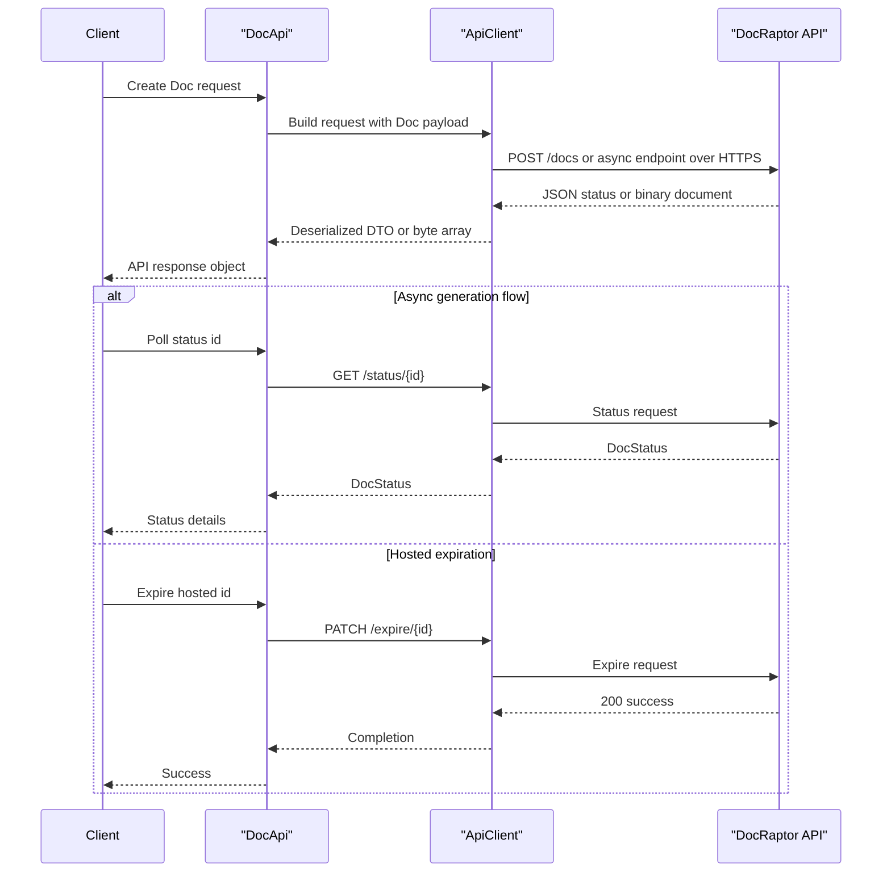

# API & Service Communication Contracts

This SDK exposes a typed contract over seven DocRaptor REST endpoints and communicates synchronously over HTTPS. The communication model is request-response with no internal asynchronous broker patterns in the library itself.

## Service Catalog

| Service | Port | Category | Purpose |
|---|---|---|---|
| docraptor-java-sdk | N/A (library) | API Layer | Provides typed Java wrapper around DocRaptor HTTP API |
| DocRaptor API | 443 | Business | Hosted external document generation service consumed by the SDK |

## API Endpoints Inventory

| Service | Method | Path | Request Type | Response Type |
|---|---|---|---|---|
| DocApi | POST | /docs | Doc | byte array (document binary) |
| DocApi | POST | /hosted_docs | Doc | DocStatus |
| DocApi | POST | /async_docs | Doc | AsyncDoc |
| DocApi | POST | /hosted_async_docs | Doc | AsyncDoc |
| DocApi | GET | /status/{id} | path id string | DocStatus |
| DocApi | GET | /download/{id} | path id string | byte array (document binary) |
| DocApi | PATCH | /expire/{id} | path id string | empty response |

## Management & Observability Endpoints

| Service | Endpoint | Custom Metrics (if any) |
|---|---|---|
| docraptor-java-sdk | None declared | None |
| DocRaptor API | Not defined in this repository | Not available in repository scope |

## DTOs & Contracts

The API contracts are represented by generated model classes: `Doc` (request payload for create operations), `AsyncDoc` (asynchronous submission acknowledgment), `DocStatus` (status polling and hosted-document metadata), and `PrinceOptions` (rendering options nested under `Doc`). These DTOs are service-level contract objects for this client library rather than gateway aggregation models. Serialization uses Jackson and Jersey integration via `JacksonJsonProvider`, and contracts are sourced from the OpenAPI specification in `docraptor.yaml`.

## Communication Patterns

All runtime calls in this repository are synchronous HTTPS requests initiated by `DocApi` through `ApiClient.invokeAPI(...)`. Asynchronous document generation is an external API behavior (submit then poll `/status/{id}` and fetch `/download/{id}`), not an internal eventing system. No retry, timeout policy tuning, circuit breaker, or service discovery framework is configured in the checked-in client code. Security posture at API contract level uses HTTP Basic authentication (API key as username) and TLS endpoints (`https://api.docraptor.com`); no additional authorization logic exists in this client.

## Service Technology Matrix

| Service | Web | Data Access | Discovery | Gateway | Actuator | Cache | Metrics |
|---|---|---|---|---|---|---|---|
| docraptor-java-sdk | Jersey client facade | None | None | No | No | No | No |
| DocRaptor API | External REST API | External | Unknown | Unknown | Unknown | Unknown | Unknown |

## Service Communication Sequence

