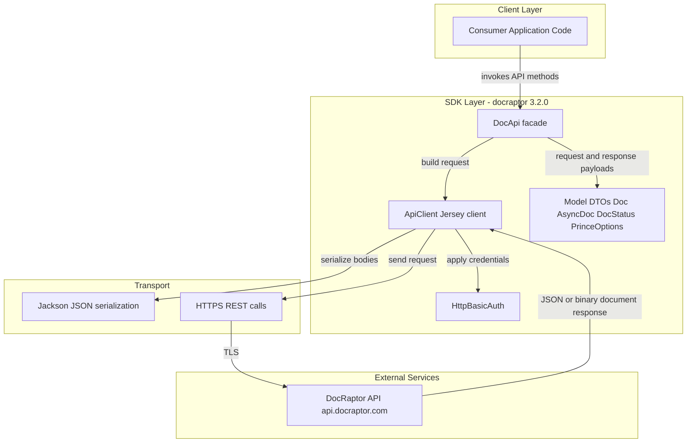
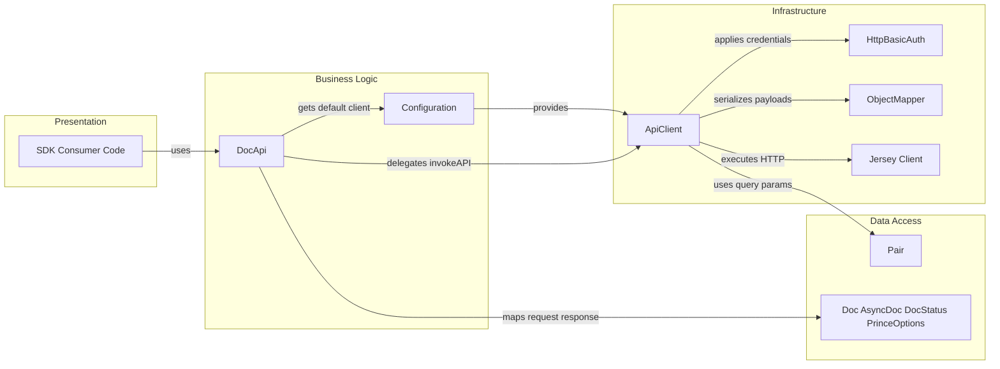

# Architecture Diagram

This repository is a Java client SDK that wraps the DocRaptor HTTP API for document generation workflows. The architecture centers on a reusable API client, API operation facade, model contracts, and outbound HTTPS communication to the DocRaptor service.

## Application Architecture

### Technology Stack Summary

| Layer | Technology | Version | Purpose |
|---|---|---|---|
| Client Integration | Java | 1.8 target | Host applications that consume the SDK |
| API Facade | Generated DocApi classes | OpenAPI-generated | Provides typed operations for DocRaptor endpoints |
| HTTP Transport | Jersey Client | 1.19.4 | Executes outbound REST calls |
| Serialization | Jackson core/databind/JAX-RS | 2.12.x | JSON serialization and deserialization |
| Auth | HTTP Basic Auth | Built-in | Sends API key as username |
| External Platform | DocRaptor API | API v2.0.0 spec | HTML to PDF/XLS/XLSX rendering service |

### Data Storage & External Services

The library itself does not manage local databases or caches. It integrates with one external service, the hosted DocRaptor API over HTTPS, and exchanges JSON request/response contracts plus binary document payloads.

### Key Architectural Decisions

- Uses generated client patterns (ApiClient + operation-specific facade) to keep endpoint contracts strongly typed.
- Keeps runtime responsibilities focused on transport, serialization, and authentication, with no embedded persistence layer.
- Centralizes outbound communication through a single configurable `ApiClient` instance.

## Component Relationships

### Component Inventory

| Component | Layer | Type | Responsibility |
|---|---|---|---|
| Consumer Application Code | Presentation | Client caller | Invokes SDK methods to create and retrieve documents |
| DocApi | Business Logic | API facade | Exposes typed methods for each REST operation |
| Configuration | Business Logic | Factory | Provides default singleton-style `ApiClient` |
| Doc / AsyncDoc / DocStatus / PrinceOptions | Data Access | DTO models | Carries API request and response contracts |
| Pair | Data Access | Utility model | Represents query parameters |
| ApiClient | Infrastructure | HTTP orchestrator | Builds requests, serializes payloads, invokes remote API |
| HttpBasicAuth | Infrastructure | Auth strategy | Adds basic auth credentials to outbound requests |
| ObjectMapper | Infrastructure | Serializer | Handles JSON serialization settings and modules |
| Jersey Client | Infrastructure | HTTP client | Executes HTTPS requests and receives responses |
