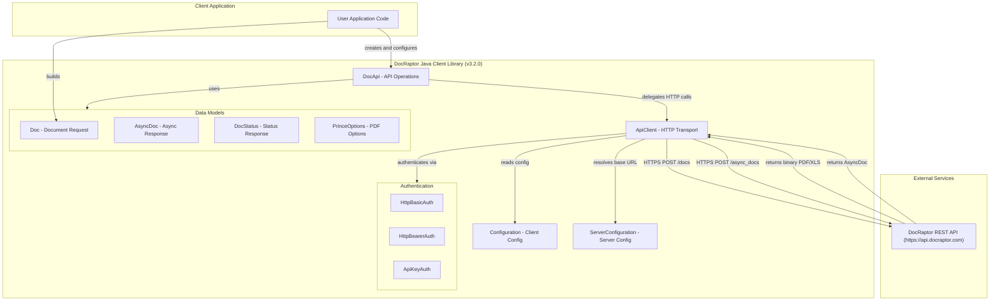
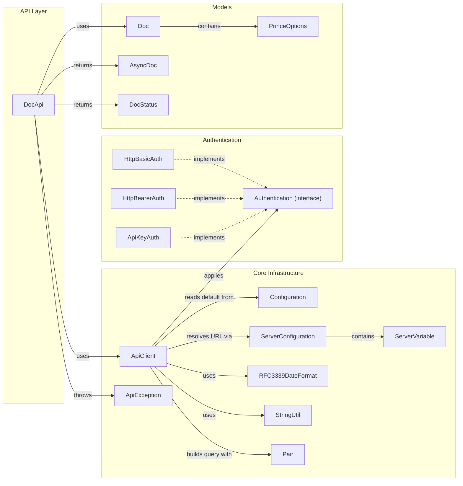

# Architecture Diagram

This document describes the architecture of the DocRaptor Java client library, a generated OpenAPI client that provides programmatic access to the DocRaptor HTML-to-PDF/XLS REST API.

## Application Architecture

### Technology Stack Summary

| Layer | Technology | Version | Purpose |
|---|---|---|---|
| API Operations | Plain Java (OpenAPI-generated) | 3.2.0 | Exposes createDoc, createAsyncDoc, getAsyncDocStatus, getAsyncDoc operations |
| HTTP Transport | Jersey Client | 1.19.4 | JAX-RS HTTP client for REST communication |
| JSON Serialization | Jackson | 2.12.6 | JSON marshaling/unmarshaling for request/response models |
| Authentication | Custom auth module | — | HTTP Basic, HTTP Bearer, API Key authentication strategies |
| Build System | Maven | 3.x | Dependency management and build lifecycle |
| Target Java Version | Java 8 | 1.8 | Minimum required JVM |

### Data Storage & External Services

This is a client library with no local data storage. All communication flows outbound to the DocRaptor REST API at `https://api.docraptor.com`. The library supports synchronous document creation (`POST /docs`) which returns a binary file, and asynchronous document creation (`POST /async_docs`) which returns a status ID. The async workflow requires polling `GET /status/{id}` until complete, then downloading via `GET /download/{id}`.

### Key Architectural Decisions

- **OpenAPI Generator-based code generation**: The entire library is auto-generated from the `docraptor.yaml` OpenAPI specification using `openapi-generator-tech`, ensuring the client stays in sync with the API contract.
- **Jersey 1.x HTTP client**: Uses `com.sun.jersey:jersey-client:1.19.4` (JAX-RS 1.x), which is end-of-life and predates Jakarta namespace migration; this is a notable cloud-readiness concern.
- **Strategy pattern for authentication**: Multiple authentication strategies (`HttpBasicAuth`, `HttpBearerAuth`, `ApiKeyAuth`) are implemented as `Authentication` interface implementations, injected into `ApiClient` at runtime.

## Component Relationships

### Component Inventory

| Component | Layer | Type | Responsibility |
|---|---|---|---|
| DocApi | API Layer | API Class | Exposes createDoc, createAsyncDoc, getAsyncDocStatus, getAsyncDoc operations |
| ApiClient | Core Infrastructure | HTTP Client | Manages HTTP connections, serialization, authentication, and server configuration |
| Configuration | Core Infrastructure | Singleton Config | Holds the default ApiClient instance |
| ServerConfiguration | Core Infrastructure | Value Object | Encapsulates server URL template and variables |
| ServerVariable | Core Infrastructure | Value Object | Represents a server URL template variable with allowed values |
| RFC3339DateFormat | Core Infrastructure | Utility | Parses and formats RFC 3339/ISO-8601 date-time strings |
| StringUtil | Core Infrastructure | Utility | String joining helpers for collection-type query parameters |
| Pair | Core Infrastructure | Value Object | Key-value pair for query/header parameters |
| ApiException | Core Infrastructure | Exception | Wraps HTTP error responses with status code and body |
| Authentication | Authentication | Interface | Strategy interface for HTTP authentication |
| HttpBasicAuth | Authentication | Strategy | Implements HTTP Basic Authentication (username/password) |
| HttpBearerAuth | Authentication | Strategy | Implements HTTP ****** Authentication |
| ApiKeyAuth | Authentication | Strategy | Implements API Key Authentication (header or query param) |
| Doc | Models | POJO | Document creation request model with content, type, and options |
| AsyncDoc | Models | POJO | Response model for asynchronous document creation |
| DocStatus | Models | POJO | Status polling response model for async document jobs |
| PrinceOptions | Models | POJO | PrinceXML-specific PDF rendering options |
