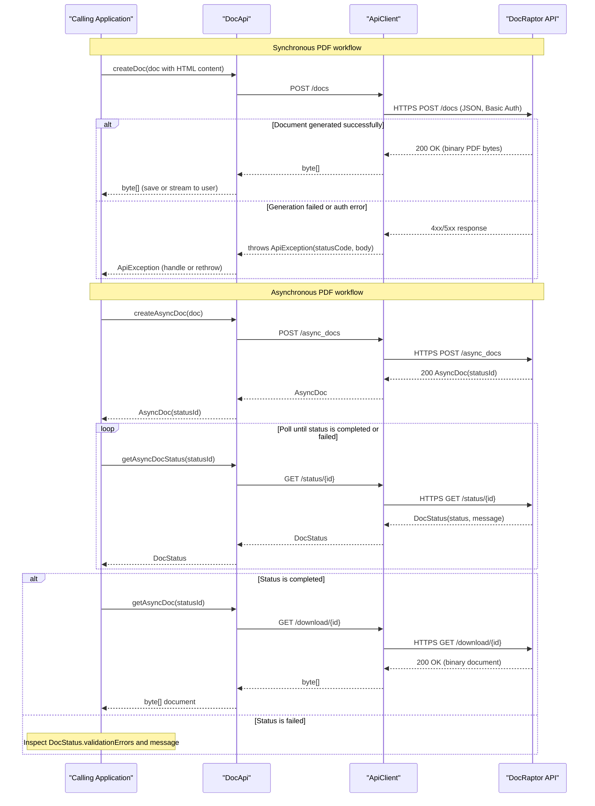

# Core Business Workflows

The DocRaptor Java client library enables Java applications to generate PDF and XLS documents from HTML content by communicating with the DocRaptor cloud document generation service. It supports both synchronous (immediate binary response) and asynchronous (polling-based) document creation workflows, as well as hosted document storage.

## Domain Entities

| Entity | Service / Bounded Context | Description | Key Relationships |
|---|---|---|---|
| Doc | Document Request | Represents a document generation request. Carries the HTML source (inline content or URL), document type (PDF/XLS), rendering options, and delivery preferences. | Contains one optional `PrinceOptions`; triggers creation of `AsyncDoc` or `DocStatus` response |
| PrinceOptions | Document Rendering | Encapsulates PrinceXML-specific PDF rendering configuration: encryption, JavaScript, CSS, proxy, authentication, and layout options. | Nested within `Doc`; no independent lifecycle |
| AsyncDoc | Async Job Tracking | Represents the acknowledgment of an asynchronous document generation job. Contains the `statusId` used to poll for completion. | Created from `Doc`; resolved via `DocStatus` through polling |
| DocStatus | Job Status / Hosted Document | Represents the current state of a document job or the result of a hosted document creation. Contains status (queued/working/completed/failed), download URL, and page count. | Result of polling `AsyncDoc.statusId`; also the direct response for hosted sync creation |

## Service-to-Domain Mapping

| Service | Domain Context | Owned Entities | External Dependencies |
|---|---|---|---|
| docraptor-java (this library) | Document Generation Client | Doc, PrinceOptions, AsyncDoc, DocStatus (all as request/response DTOs) | DocRaptor REST API (external SaaS) |
| DocRaptor REST API (external) | Document Generation Engine | All persistent job state, document storage, hosted file management | PrinceXML rendering engine (managed by DocRaptor) |

This is a single-module client library with no microservice decomposition. All domain logic resides in the remote DocRaptor service; the library provides a typed Java façade over the REST API.

## Primary Workflows

### Workflow 1: Synchronous Document Generation

The caller submits an HTML document and receives a binary PDF or XLS file in a single blocking call.

**Steps:**
1. Caller constructs a `Doc` object with `documentContent` (inline HTML) or `documentUrl`, sets `documentType` to `"pdf"` or `"xls"`, and sets `test = false` for production.
2. Caller invokes `DocApi.createDoc(doc)`.
3. The library serializes `Doc` to JSON and sends `POST /docs` to `api.docraptor.com` with HTTP Basic Auth.
4. The DocRaptor service renders the document and returns the binary result synchronously.
5. The library deserializes the response and returns `byte[]` to the caller.
6. On HTTP 4xx/5xx, the library throws `ApiException` with the status code and response body.

**Business rules involved:** `test` flag controls whether a real document is generated (billed) or a watermarked test document. `documentType` must be `"pdf"` or `"xls"`.

---

### Workflow 2: Asynchronous Document Generation

Used for large or complex documents where the generation time may exceed acceptable synchronous wait times.

**Steps:**
1. Caller constructs a `Doc` object (optionally with `callbackUrl` for push notification).
2. Caller invokes `DocApi.createAsyncDoc(doc)`.
3. The library sends `POST /async_docs` and receives `AsyncDoc` with a `statusId`.
4. Caller periodically calls `DocApi.getAsyncDocStatus(statusId)` to poll `GET /status/{id}`.
5. When `DocStatus.status == "completed"`, caller calls `DocApi.getAsyncDoc(statusId)` to download the binary result.
6. If `DocStatus.status == "failed"`, `DocStatus.validationErrors` and `DocStatus.message` describe the failure.

**Business rules involved:** The polling interval and maximum wait time are entirely the caller's responsibility — no retry or timeout logic is built into this library. The `callbackUrl` alternative allows the DocRaptor service to notify the caller when complete, eliminating the need to poll.

---

### Workflow 3: Hosted Document Generation

Generates a document and stores it on DocRaptor's servers, returning a shareable download URL rather than the binary content directly.

**Steps:**
1. Caller sets `doc.hosted = true` (or uses `createHostedDoc` / `createHostedAsyncDoc`).
2. **Synchronous hosted**: `DocApi.createHostedDoc(doc)` → returns `DocStatus` with `downloadUrl` and `downloadId`.
3. **Asynchronous hosted**: `DocApi.createHostedAsyncDoc(doc)` → returns `AsyncDoc`; caller polls for `DocStatus` with `downloadUrl`.
4. `hostedDownloadLimit` controls how many times the URL can be used (default: unlimited). `hostedExpiresAt` sets expiry.
5. The caller shares or stores the `downloadUrl` — the binary is not returned directly.

**Business rules involved:** `hostedDownloadLimit` and `hostedExpiresAt` on `Doc` enforce access controls on the hosted file. These are enforced by the DocRaptor service, not this library.

---

### Workflow 4: PrinceXML PDF Customization

Callers requiring advanced PDF features configure a `PrinceOptions` object on the `Doc` before submission.

**Steps:**
1. Caller creates `PrinceOptions` and sets relevant properties (JavaScript execution, CSS media type, encryption, proxy, compression, embedded/subset fonts, etc.).
2. Caller sets `doc.setPrinceOptions(options)`.
3. `PrinceOptions` is serialized as a nested JSON object inside the `Doc` payload.
4. The DocRaptor service passes these options to PrinceXML for rendering.

**Business rules involved:** Password-protected PDFs require both `userPassword` (opens/reads) and `ownerPassword` (editing/printing permissions), with optional permission flags (`disallowPrint`, `disallowCopy`, `disallowAnnotate`, `disallowModify`).

## Cross-Service Data Flows

This library has a single external data flow: the calling application → this library → DocRaptor REST API.

There is no gateway aggregation, no microservice composition, and no multi-service data merging. The library acts as a typed façade:

- **Request path**: Caller builds `Doc` (and optionally `PrinceOptions`) → library serializes to JSON → HTTP POST to DocRaptor.
- **Response path**: DocRaptor returns binary bytes or a JSON `DocStatus`/`AsyncDoc` → library deserializes → returns typed object to caller.
- **Fallback behavior**: No circuit breaker or fallback exists in the library. If DocRaptor is unavailable, the Jersey HTTP client will block until `connectionTimeout` (default: infinite) is reached or throw an exception. Callers must implement their own fallback logic.

## Business Workflow Sequence

## Business Rules & Decision Logic

### Validation Rules

- **`doc` parameter is required**: `DocApi` validates that the `doc` argument is non-null before making any HTTP call; throws `ApiException(400, "Missing the required parameter 'doc'")` if null. Same pattern applies to `id` in status/download methods.
- **`documentType`**: Must be `"pdf"` or `"xls"`. This is enforced by the remote service; no client-side enum validation beyond the Jackson-serialized `DocumentTypeEnum`.
- **`strict`**: Controls strict rendering mode for PDF/HTML spec compliance. Accepted values are `"none"` or `"html"` (`StrictEnum`).
- **`test` flag**: Defaults to `true` in the `Doc` model. When `true`, generates a watermarked test document at no charge. Callers must explicitly set `test = false` for production billable documents.

### State Transitions

Async document job lifecycle (managed by DocRaptor service):
- `queued` → `working` → `completed` (success path)
- `queued` → `working` → `failed` (failure path)

### Business Constraints

- **`ignoreResourceErrors`**: Defaults to `true` — missing images/stylesheets do not fail the job. Set to `false` to enforce strict resource loading.
- **`ignoreConsoleMessages`**: Defaults to `false` — JavaScript console messages are treated as errors. Set to `true` to permit JS console output.
- **`hostedDownloadLimit`**: If set, restricts how many times a hosted document URL can be downloaded before it is invalidated by the remote service.
- **`hostedExpiresAt`**: ISO 8601 timestamp after which a hosted document URL expires. Enforced by the DocRaptor service.

### Error Handling

- All HTTP errors from the DocRaptor API are wrapped in `ApiException`, which carries the HTTP status code, response body, and response headers.
- No retry, exponential backoff, or circuit breaker logic is implemented. Callers must implement resilience externally.
- `ApiException` is a checked exception — callers must either catch it or declare it.

### Cross-Cutting Concerns

- **Authentication**: HTTP Basic Auth via `HttpBasicAuth`; the API key is the username; password is empty. Applied by `ApiClient` to every outbound request.
- **Logging**: Jersey's built-in `java.util.logging.LoggingFilter` is available but not enabled by default. Can be activated via `apiClient.setDebugging(true)`. **Caution**: enabling debugging logs full request and response bodies, which may expose the API key, PDF passwords, and document content.
- **Transactions**: Not applicable — no local persistence.
- **Audit trail**: Not applicable — no event logging or audit framework. Remote DocRaptor service maintains its own usage/billing records.
