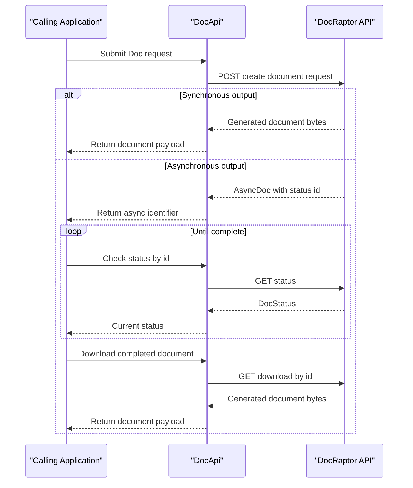

# Core Business Workflows

This project supports document-generation workflows for developers integrating DocRaptor into their own systems. The core business flow is preparing a document request, submitting it to DocRaptor, and retrieving either immediate or asynchronous output.

## Domain Entities

| Entity | Service / Bounded Context | Description | Key Relationships |
|---|---|---|---|
| Doc | Document Submission | Represents a document generation request and rendering options | Used as input for synchronous and asynchronous creation operations |
| AsyncDoc | Asynchronous Processing | Represents acknowledgment of async document job submission | Linked to later status checks and download retrieval |
| DocStatus | Document Lifecycle Tracking | Represents generation state and hosted/download metadata | Consumed after async submission and hosted document creation |
| PrinceOptions | Rendering Configuration | Encapsulates advanced rendering behavior for generated documents | Nested option set used by Doc request contracts |

## Service-to-Domain Mapping

| Service | Domain Context | Owned Entities | External Dependencies |
|---|---|---|---|
| docraptor-java-sdk | Client Integration | Doc, AsyncDoc, DocStatus, PrinceOptions | DocRaptor API over HTTPS |
| DocRaptor API | Document Rendering Platform | Remote document job lifecycle | External service not implemented in this repository |

## Primary Workflows

### Workflow 1: Synchronous Document Generation

1. Calling application constructs a `Doc` request with content or URL, type, and options.
2. Application invokes `DocApi.createDoc`.
3. SDK validates required request input and submits the payload to `/docs`.
4. DocRaptor renders the document and returns binary output in the same request cycle.
5. Application handles the returned byte stream (save, stream, or process).

### Workflow 2: Asynchronous Document Generation and Retrieval

1. Calling application submits `Doc` using `createAsyncDoc` or `createHostedAsyncDoc`.
2. SDK receives `AsyncDoc` containing an identifier for status tracking.
3. Application polls `getAsyncDocStatus` until processing is complete.
4. Application retrieves final output using `getAsyncDoc` with the returned download identifier.
5. Optionally, application calls `expire` for hosted document lifecycle cleanup.

## Cross-Service Data Flows

All business data exchange is between the consuming application and the hosted DocRaptor API through the SDK. The client transmits document requests and receives either immediate binary output or status-driven async outputs. No cross-service aggregation is implemented in this repository, and no fallback composition path is present when the external service is unavailable.

## Business Workflow Sequence

## Business Rules & Decision Logic

- A document request must include required business inputs (such as document name, type, and content/url path per API contract) before submission.
- The caller chooses synchronous vs asynchronous processing based on expected rendering duration and integration flow requirements.
- Asynchronous lifecycle requires status polling before download retrieval.
- Hosted document management includes optional explicit expiration to end hosted availability.
- Authentication credentials must be configured in the client before any workflow step can complete successfully.
