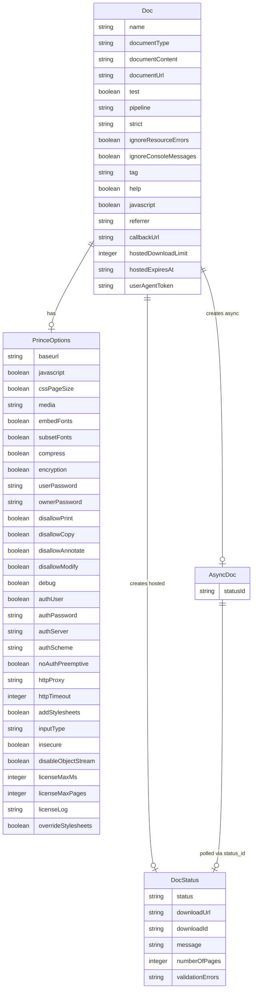

# Data Architecture & Persistence Layer

This library contains 4 data transfer objects (DTOs) that model the JSON API contract with the remote DocRaptor service. There is no local database, ORM, or persistence layer — all models represent in-memory request/response structures serialized over HTTP.

## Database Configuration

| Service/Module | DB Type | Profile | Driver | Connection | Migration Tool |
|---|---|---|---|---|---|
| docraptor-java | None | N/A | None | No local database used | None |

No database is configured. This is a client library; all persistent state resides in the remote DocRaptor SaaS service.

## Data Ownership per Service

| Service | Entities Owned | ORM Framework | Caching | Notes |
|---|---|---|---|---|
| docraptor-java | Doc, AsyncDoc, DocStatus, PrinceOptions | None (plain Jackson POJOs) | None | DTOs only; no persistence layer |

## Entity Model

> Note: These are API DTOs, not database entities. No JPA/Hibernate annotations are present. The diagram represents the in-memory object model serialized to/from JSON.

## Key Repository Methods

| Service | Class | Method / Operation | Purpose |
|---|---|---|---|
| docraptor-java | DocApi | `createDoc(Doc doc) : byte[]` | Synchronous document generation; returns binary PDF/XLS |
| docraptor-java | DocApi | `createAsyncDoc(Doc doc) : AsyncDoc` | Asynchronous document generation; returns status ID for polling |
| docraptor-java | DocApi | `createHostedDoc(Doc doc) : DocStatus` | Synchronous generation with hosting; returns download URL |
| docraptor-java | DocApi | `createHostedAsyncDoc(Doc doc) : AsyncDoc` | Async generation with hosting; returns status ID |
| docraptor-java | DocApi | `getAsyncDocStatus(String id) : DocStatus` | Polls status of an async job |
| docraptor-java | DocApi | `getAsyncDoc(String id) : byte[]` | Downloads completed async document binary |

No repositories, `@Query` methods, custom finders, or database-level data access patterns exist in this codebase.

## Caching Strategy

No caching is implemented. This is a stateless HTTP client library; there are no in-memory caches, session caches, query result caches, or second-level caches. Each API call results in a fresh HTTP request to the remote service. Consumers of the library are responsible for any caching they require.

## Data Ownership Boundaries

The library owns no data stores. All data ownership resides in the remote DocRaptor SaaS API:

- `Doc` and `PrinceOptions` are **request models** — owned and discarded by the calling application after the HTTP request is made.
- `AsyncDoc` and `DocStatus` are **response models** — transient objects populated from the API response and not persisted locally.

There are no cross-service data access patterns, CQRS separations, or event-driven data flows within this library.

### Data Classification & Sensitivity

| Entity | Sensitive Fields | Classification | Controls in Place |
|---|---|---|---|
| Doc | `documentContent`, `documentUrl` | Potentially sensitive — may contain business HTML/data submitted for rendering | No encryption-at-rest; data is transmitted over HTTPS to DocRaptor. Content is not persisted locally. |
| Doc | `userAgentToken`, `callbackUrl` | Configuration metadata | Transmitted over HTTPS; no local storage |
| PrinceOptions | `userPassword`, `ownerPassword` | Credentials (PDF encryption passwords) | Transmitted over HTTPS; stored in caller's memory only; no masking in `toString()` — may leak to logs |
| AsyncDoc | `statusId` | Document identifier | Low sensitivity; used only for polling |
| DocStatus | `downloadUrl`, `downloadId` | Temporary download credentials | URL may be time-limited; no local persistence |

**Notable concern**: `PrinceOptions.toString()` (auto-generated by OpenAPI Generator) will print `userPassword` and `ownerPassword` in plaintext if logged. No masking or redaction is applied. Callers should avoid logging `Doc` or `PrinceOptions` objects at INFO/DEBUG level.

No PII, PHI, or PCI data is stored by this library. However, the HTML content submitted in `documentContent` may contain PII depending on the calling application's use case — this is outside the library's control.
