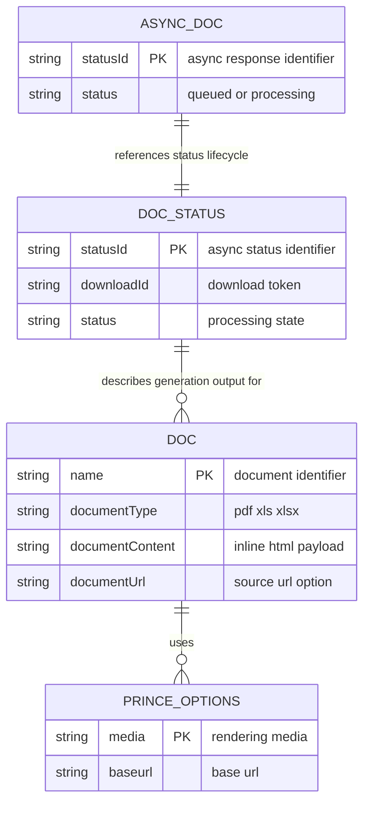

# Data Architecture & Persistence Layer

This repository operates as an API client SDK and does not own an application database. The data layer consists of in-memory request and response models serialized to and from DocRaptor API contracts.

## Database Configuration

| Service/Module | DB Type | Profile | Driver | Connection | Migration Tool |
|---|---|---|---|---|---|
| docraptor-java-sdk | None | default | None | No local database connection configured | None |

## Data Ownership per Service

| Service | Tables Owned | ORM Framework | Caching | Notes |
|---|---|---|---|---|
| docraptor-java-sdk | None | None | None | SDK owns contract classes only; persistence is external to this repository |

## Entity Model

## Key Repository Methods

| Service | Repository | Notable Methods | Purpose |
|---|---|---|---|
| docraptor-java-sdk | None | None | Project does not implement repository interfaces or local persistence access methods |

## Caching Strategy

No application-side caching provider or cache abstraction is configured in this repository. Each API call is executed directly through `ApiClient` and responses are returned to the caller without local cache storage.

## Data Ownership Boundaries

Data storage is fully externalized to the DocRaptor platform. The SDK does not expose direct database access paths and does not share storage with other local services. All data movement occurs as request and response payloads across HTTPS, with the client acting as a transport and contract boundary.

### Data Classification & Sensitivity

| Entity | Sensitive Fields | Classification (PII/PHI/PCI/None) | Controls in Place |
|---|---|---|---|
| Doc | Potential HTML input that may include user business content | PII possible in payload content | Transport security via HTTPS to remote API; no local at-rest persistence in this repo |
| AsyncDoc | status identifiers | None | No local persistence |
| DocStatus | download identifiers and status metadata | None | No local persistence |
| PrinceOptions | rendering options | None | No local persistence |
