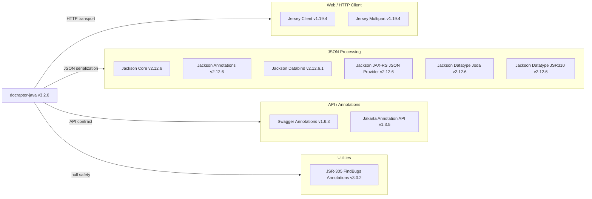

# Dependency Map

The DocRaptor Java client library (v3.2.0) declares 10 external dependencies (excluding test scope) managed via Maven `pom.xml`, covering HTTP transport, JSON serialization, authentication annotations, and API documentation.

## Dependencies

### Dependency Summary

| Category | Count | Key Libraries | Notes |
|---|---|---|---|
| Web / HTTP Client | 2 | Jersey Client 1.19.4, Jersey Multipart 1.19.4 | Jersey 1.x (JAX-RS 1.x) is end-of-life since 2016; does not use Jakarta namespace |
| JSON Processing | 6 | Jackson Core/Databind/Annotations 2.12.6, Jackson JAX-RS, Joda, JSR310 datatypes | Databind uses a patch release (2.12.6.1) for a CVE fix; minor version behind current |
| API / Annotations | 2 | Swagger Annotations 1.6.3, Jakarta Annotation API 1.3.5 | Swagger 1.x annotations (not OpenAPI 3.x) |
| Utilities | 1 | JSR-305 (FindBugs) 3.0.2 | Used only for `@Nullable` / `@Nonnull` annotations |

### Version & Compatibility Risks

The most significant risk is **Jersey 1.x (`com.sun.jersey:jersey-client:1.19.4`)**, which reached end-of-life in 2016 and relies on the legacy `javax.ws.rs` (JAX-RS 1.x) namespace. This conflicts with Jakarta EE 9+ environments that use the `jakarta.ws.rs` namespace, making the library incompatible with modern application server runtimes (Tomcat 10+, WildFly 27+, Spring Boot 3.x). Jackson 2.12.x is also behind the current 2.17.x line and predates several security and performance improvements; however, the patched `jackson-databind:2.12.6.1` addresses the most critical known CVEs in that minor series. **Swagger Annotations 1.6.3** (Swagger 2.x / OpenAPI 2.x) is inconsistent with the library's own `docraptor.yaml` which is an OpenAPI 3.x document.

### Notable Observations

- **Jersey 1.x is a critical modernization blocker**: Migrating to Jersey 3.x or switching to an alternative HTTP client (Apache HttpClient 5, OkHttp, Java 11 `java.net.http.HttpClient`) is required for Jakarta EE 9+ or Spring Boot 3.x compatibility.
- **Jackson is used in six separate artifacts**: All are pinned to the same minor version via Maven properties (`${jackson-version}`), which is good practice, but the collection could be simplified.
- **`jakarta.annotation-api:1.3.5` uses `javax.annotation` namespace** (Jakarta EE 8 / pre-rename), not `jakarta.annotation` (Jakarta EE 9+). Combined with Jersey 1.x, the entire HTTP stack is bound to the old `javax` namespace.
- **No logging framework declared**: The project has no SLF4J, Log4j, or Logback dependency. Jersey's built-in `java.util.logging` is used implicitly, which offers limited observability.

## Test Dependencies

| Framework | Version | Scope |
|---|---|---|
| JUnit | 4.13.2 | test |

Total test-scope dependencies: 1

Only JUnit 4 is declared as a test dependency. There are no mocking frameworks (e.g., Mockito), assertion libraries (e.g., AssertJ), or integration test utilities. JUnit 4 is in maintenance mode; upgrading to JUnit 5 (Jupiter) is recommended for any significant test suite expansion.
