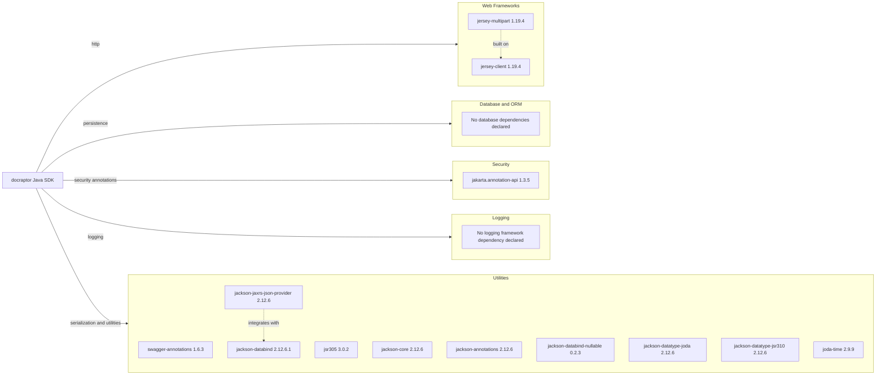

# Dependency Map

This Java SDK project declares a compact set of runtime dependencies for HTTP transport, JSON handling, date support, and annotations, plus one test framework dependency. The runtime dependency surface is approximately 11 libraries (excluding plugins and test scope).

## Dependencies

### Dependency Summary

| Category | Count | Key Libraries | Notes |
|---|---:|---|---|
| Web Frameworks | 2 | jersey-client, jersey-multipart | Legacy Jersey 1.x client stack for REST calls |
| Database / ORM | 0 | None | SDK does not persist local data |
| Messaging | 0 | None | No messaging client dependencies |
| Caching | 0 | None | No caching library declared |
| Logging | 0 | None | Uses optional Jersey logging filter instead of a logging framework dependency |
| Security | 1 | jakarta.annotation-api | Provides annotation compatibility support |
| Observability | 0 | None | No metrics/tracing dependencies |
| Utilities | 10 | Jackson modules, Swagger annotations, Joda-Time | Serialization, typing, and compatibility support |

### Version & Compatibility Risks

The project targets Java 8 and uses legacy Jersey 1.19.4 plus Joda-Time 2.9.9, both of which are older-generation dependencies that may require modernization for newer Jakarta or Java runtime ecosystems. Jackson 2.12.x is stable but not current, so compatibility and vulnerability posture should be tracked as upstream updates are released.

### Notable Observations

- Dependency set is intentionally lean and focused on API transport plus serialization.
- Multiple Jackson modules are used to support date/time variants and nullable schema behavior.
- No ORM, database, cache, or messaging dependencies are present, consistent with an API client library role.
- Test dependencies are minimal, indicating lightweight validation coverage from dependency perspective.

## Test Dependencies

| Framework | Version | Notes |
|---|---|---|
| JUnit | 4.13.2 | Primary test framework declared in Maven and Gradle test scopes |

Total test-scope dependencies: 1

The project has a minimal test dependency footprint centered on JUnit 4, with no dedicated mocking or integration test dependency declared in the main build files.
